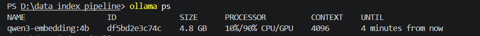

# Data Indexing Pipeline — Giáo trình Tư tưởng Hồ Chí Minh

Pipeline RAG cho giáo trình: đọc PDF, làm sạch và chia nhỏ văn bản, sinh embedding bằng Ollama chạy local, lưu vector kèm metadata vào **Qdrant**, rerank bằng Qwen3-Reranker, rồi trả lời bằng Gemini qua nhiều lớp guardrail.

## Cấu trúc

```
app/                    Backend FastAPI
  main.py               Dựng app: nạp model lúc khởi động, CORS, gắn router, phục vụ web/dist
  deps.py               Pipeline RAG dùng chung giữa các router (get_rag)
  auth.py               Băm mật khẩu Argon2, JWT, refresh token, cookie, chống CSRF, get_current_user
  db.py                 Bảng PostgreSQL (SQLAlchemy): users, conversations, messages, refresh_tokens, đề thi
  routers/
    qa.py               GET /health, POST /search, POST /ask
    auth.py             /auth/register, /login, /refresh, /logout, /me
    chat.py             /conversations, POST /chat (stream NDJSON, lưu lịch sử)
rag/                    Lõi RAG
  reranker.py           Qwen3-Reranker-0.6B: chấm P(yes) cho từng cặp (câu hỏi, chunk)
  search_rerank.py      Qdrant → rerank → retrieval guard (pass / partial / refuse)
  guards.py             Các lớp guardrail: 1a regex, 1b Qwen3Guard, 3 system prompt, 4c trích dẫn, 4a giám khảo
  pipeline.py           GuardedRAG: ghép toàn bộ luồng hỏi–đáp
scripts/                Công cụ dòng lệnh (chạy bằng python -m scripts.<tên> ở thư mục gốc)
  ingest.py             Load PDF → clean → chunk → embed → upsert Qdrant
  search.py             Kiểm thử semantic search thuần (có filter theo chương)
  calibrate.py          Hiệu chỉnh ngưỡng lớp 2 (retrieval guard)
  eval_ragas.py         Đánh giá chất lượng câu trả lời bằng RAGAS
  list_models.py        Liệt kê model Gemini mà API key gọi được
  create_user.py        Tạo tài khoản (vd. quản trị viên đầu tiên)
  migrate_auth.py       Nâng database cũ lên có đăng nhập
  migrate_sqlite.py     Chuyển lịch sử chat cũ từ SQLite sang PostgreSQL (đã chạy xong)
tests/                  pytest: reranker, guardrail, pipeline, database, API, đăng nhập (không tốn quota Gemini)
data/                   Giáo trình PDF, bộ câu hỏi đánh giá (eval_testset.json), kết quả đánh giá (eval_runs/)
docs/                   Nhật ký thay đổi (CHANGES-*.md), ảnh chụp kết quả (screenshots/)
web/                    Web chat React + Vite (xem web/README.md)
```

## Luồng xử lý một câu hỏi

```
Câu hỏi
  ├─ 1a. basic_input_check   (regex, ~0 ms)        → chặn rỗng / quá dài / injection lộ liễu
  ├─ 1b. Qwen3Guard + input_policy (0.6B)          → pass / strict / block
  │      (chạy song song với embed + Qdrant + rerank)
  ├─ 2.  retrieval_guard     (search_rerank.py)    → tài liệu có đủ liên quan không
  ├─ 3.  SYSTEM_PROMPT + build_context             → ràng buộc Gemini chỉ dùng giáo trình
  │        Gemini sinh câu trả lời
  ├─ 4c. check_citations     (regex, ~0 ms)        → trích dẫn có khớp nguồn thật không
  └─ 4a. Gemini giám khảo    (chỉ khi strict / partial / trích dẫn sai)
```

## Cách chạy

```bash
# 1. Thư viện (GPU NVIDIA: cài torch bản CUDA trước)
pip install torch --index-url https://download.pytorch.org/whl/cu128
pip install -r requirements.txt

# 2. Ollama embedding
ollama pull qwen3-embedding:4b

# 3. Qdrant (Docker, dữ liệu lưu trong volume qdrant_storage)
docker run -d --name qdrant -p 6333:6333 -p 6334:6334 -v qdrant_storage:/qdrant/storage --restart unless-stopped qdrant/qdrant
```

File `.env`:

```
GEMINI_API_KEY=...
# Tuỳ chọn (đều có mặc định)
QDRANT_URL=http://localhost:6333     # hoặc QDRANT_PATH=./qdrant_data để chạy nhúng, không cần Docker
QDRANT_COLLECTION=tu_tuong_hcm
GEMINI_MODEL=gemini-3.8-flash        # xem tên hợp lệ bằng: python -m scripts.list_models
GEMINI_THINKING=low                  # none nếu model không hỗ trợ thinking_level
GUARD_DEVICE=cuda                    # cpu: guard không chiếm VRAM nhưng chậm hơn (~7s/câu)
EMBED_NUM_CTX=1024                   # context Ollama lúc truy vấn (nhỏ → tốn ít VRAM)
```

Chạy (luôn ở thư mục gốc dự án, vì các lệnh `python -m` và `uvicorn app.main:app` tìm module từ đây):

```bash
python -m scripts.ingest          # tạo lại collection + nạp 585 chunk
python -m scripts.search          # semantic search thuần
python -m rag.search_rerank       # so sánh thứ hạng cosine vs rerank + retrieval guard
python -m rag.pipeline            # demo toàn bộ guardrail với 6 câu hỏi
uvicorn app.main:app --port 8000  # API, tài liệu tại http://localhost:8000/docs
pytest -q                         # toàn bộ test (-m "not slow" để bỏ test nạp model thật)
```

Web chat (cần Node.js ≥ 20):

```bash
cd web && npm install && npm run build   # sau đó mở http://localhost:8000
# hoặc dev có hot reload: cd web && npm run dev  → http://localhost:5173
```

Ví dụ gọi API:

```bash
curl -X POST localhost:8000/ask -H "Content-Type: application/json"      -d '{"question": "Quan điểm của Hồ Chí Minh về đại đoàn kết toàn dân tộc?"}'
curl -X POST localhost:8000/search -H "Content-Type: application/json"      -d '{"question": "Phương pháp nghiên cứu môn học?", "chapter": "Chương Mở đầu", "top_n": 3}'
```

> Windows: nếu chuyển hướng output ra file/pipe bị `UnicodeEncodeError`, đặt `PYTHONUTF8=1`.
> Gõ tiếng Việt trực tiếp trong `curl` trên Git Bash có thể bị sai mã hoá → dùng `/docs` hoặc Python `httpx`.

**VRAM (GPU 6 GB):** Ollama ~3.3 GB (num_ctx 1024) + Qwen3-Reranker fp16 ~1.2 GB + Qwen3Guard fp16 ~1.2 GB. Guard và reranker dùng chung 1 khoá GPU nên một câu hỏi mất khoảng 3–4 s cho phần chạy local (chưa tính Gemini).

---

## 1. chunk_size và chunk_overlap

Chọn `chunk_size = 800` và `chunk_overlap = 100`.

**Lý do chọn chunk_size = 800 ký tự:** Giáo trình lý luận chính trị có câu dài, một luận điểm thường trải qua vài câu liên tiếp. Nếu chunk quá nhỏ, một luận điểm bị cắt rời thành nhiều mảnh, mỗi vector chỉ mang nửa ý nên khi search sẽ trả về đoạn cụt, thiếu ngữ cảnh. Ngược lại nếu chunk quá lớn thì vector bị loãng: một vector phải đại diện cho nhiều chủ đề khác nhau nên không còn đặc trưng cho chủ đề nào, làm giảm độ chính xác. 800 ký tự đủ chứa trọn 1–2 đoạn văn hoàn chỉnh, đồng thời nằm rất xa giới hạn context 4096 token của model nên không chunk nào bị cắt cụt khi embed.

**Lý do chọn chunk_overlap = 100 ký tự :** đủ để bắc cầu khoảng 1–2 câu giữa hai chunk liền kề mà không tạo ra quá nhiều dữ liệu trùng lặp.


**Rủi ro nếu set chunk_overlap = 0:** Một luận điểm nằm sát ranh giới hai chunk sẽ bị chặt đôi, nửa đầu ở chunk A, nửa sau ở chunk B, không chunk nào chứa trọn ý. Khi search, cả hai chunk đều chỉ khớp một phần với câu hỏi nên cosine similarity của cả hai đều thấp, dẫn đến cả hai cùng bị loại khỏi Top-K — dù ghép lại chúng chính là câu trả lời đúng nhất. 

## 2. Model Ollama và Vector Dimension

- Model: `qwen3-embedding:4b`
- Vector dimension: **2560**
- Distance dùng trên Qdrant: `Cosine`

Xác định dimension bằng cách embed thử một câu ngắn rồi đo độ dài vector trả về, thay vì đoán theo tên model:

```python
sample_vector = embedder.embed_query("kiểm tra dimension")
print(len(sample_vector))   # 2560
```

Phải đo chính xác vì Qdrant yêu cầu khai báo kích thước vector cố định ngay khi tạo collection và không sửa được sau đó. Nếu khai sai, mọi lệnh upsert đều thất bại với lỗi dimension mismatch và phải xoá collection tạo lại từ đầu. `ingest.py` dùng luôn giá trị đo được để tạo collection.

## 3. Model chạy trên GPU hay CPU

Model chạy chủ yếu trên GPU, cụ thể là phân bổ **10% CPU / 90% GPU**. Đây là chế độ partial offload: model nặng 4.8 GB, VRAM chỉ đủ nạp 90% số layer lên GPU, 10% còn lại phải để trên CPU. Ollama tự quyết định tỉ lệ này dựa trên VRAM khả dụng.

**Cách kiểm tra:** chạy `ollama ps` ở một terminal khác trong lúc model đang được nạp (tức lúc `ingest.py` hoặc `search.py` đang chạy embed):

```
NAME                 ID            SIZE    PROCESSOR        CONTEXT  UNTIL
qwen3-embedding:4b   df5bd2e3c74c  4.8 GB  10%/90% CPU/GPU  4096     4 minutes from now
```



## 4. Kết quả chạy search.py

(Ảnh chụp dưới đây là từ bản dùng Pinecone trước đây; chạy lại `python -m scripts.search` để xem kết quả trên Qdrant.)

Ba câu hỏi kiểm thử:

| # | Câu hỏi | Metadata Filter |
|---|---|---|
| 1 | Nguồn gốc và tiền đề hình thành tư tưởng Hồ Chí Minh là gì? | Không |
| 2 | Quan điểm của Hồ Chí Minh về đại đoàn kết toàn dân tộc? | Không |
| 3 | Đối tượng và phương pháp nghiên cứu của môn học là gì? | `chapter = "Chương Mở đầu"` (Qdrant `FieldCondition`) |


chạy server

Bước 2: bật API (terminal 1)

cd /Users/pmhieu7/Documents/GitHub/rag-tu-tuong-hcm-pipeline
source .venv/bin/activate
uvicorn app.main:app --port 8000

Bước 3: bật trang web (terminal 2)

cd /Users/pmhieu7/Documents/GitHub/rag-tu-tuong-hcm-pipeline/web
npm run dev

đăng nhập postgre
docker exec -it postgres psql -U hcm -d hcm_chat
\dt                      -- list all tables (users, conversations, messages)
\d users                 -- show the columns of the users table
SELECT * FROM users;     -- show every row
\q                       -- quit
