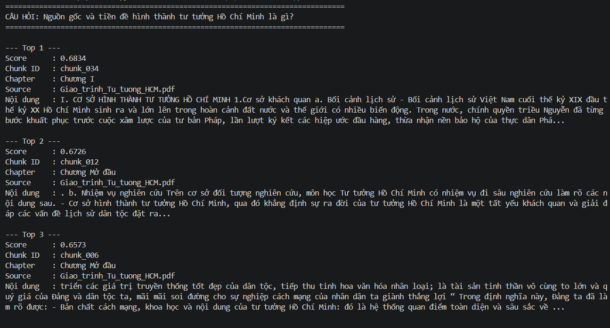
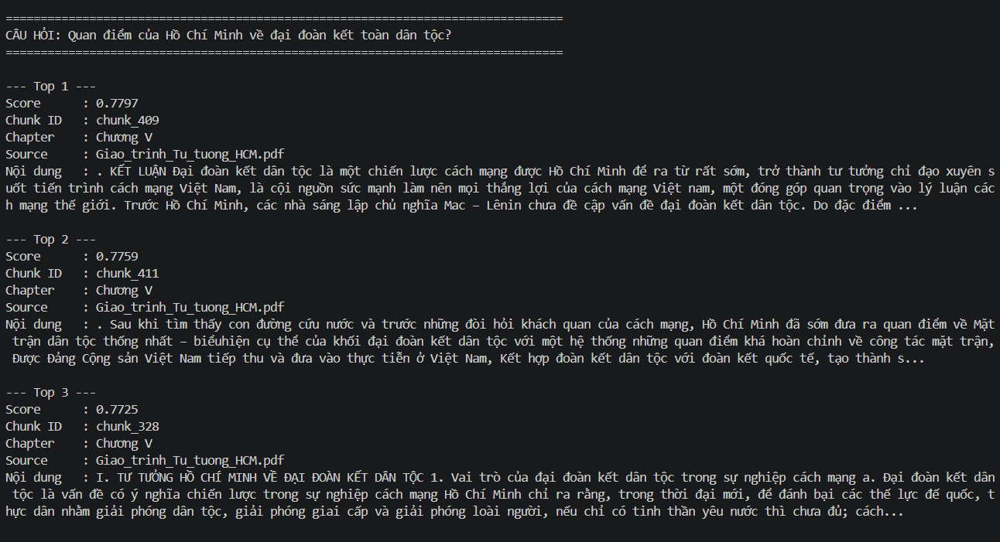
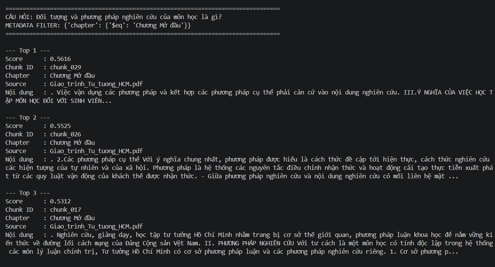

# Data Indexing Pipeline — Giáo trình Tư tưởng Hồ Chí Minh

Pipeline RAG cho phần Data Ingestion & Indexing: đọc PDF giáo trình, làm sạch và chia nhỏ văn bản, sinh embedding bằng Ollama chạy local, lưu vector kèm metadata lên Pinecone, và kiểm thử bằng semantic search.

## Cấu trúc

```
ingest.py           Pipeline: load PDF → clean → chunk → embed → upsert Pinecone
search.py           Script kiểm thử truy vấn
requirements.txt    Package và version
screenshort/        Ảnh chụp kết quả chạy
```

## Cách chạy

```bash
pip install -r requirements.txt
ollama pull qwen3-embedding:4b
ollama serve
```

Tạo file `.env` chứa `PINECONE_API_KEY=...`, sau đó:

```bash
python ingest.py
python search.py
```

---

## 1. chunk_size và chunk_overlap

Chọn `chunk_size = 800` và `chunk_overlap = 100`.

**Lý do chọn chunk_size = 800 ký tự:** Giáo trình lý luận chính trị có câu dài, một luận điểm thường trải qua vài câu liên tiếp. Nếu chunk quá nhỏ, một luận điểm bị cắt rời thành nhiều mảnh, mỗi vector chỉ mang nửa ý nên khi search sẽ trả về đoạn cụt, thiếu ngữ cảnh. Ngược lại nếu chunk quá lớn thì vector bị loãng: một vector phải đại diện cho nhiều chủ đề khác nhau nên không còn đặc trưng cho chủ đề nào, làm giảm độ chính xác. 800 ký tự đủ chứa trọn 1–2 đoạn văn hoàn chỉnh, đồng thời nằm rất xa giới hạn context 4096 token của model nên không chunk nào bị cắt cụt khi embed.

**Lý do chọn chunk_overlap = 100 ký tự :** đủ để bắc cầu khoảng 1–2 câu giữa hai chunk liền kề mà không tạo ra quá nhiều dữ liệu trùng lặp.


**Rủi ro nếu set chunk_overlap = 0:** Một luận điểm nằm sát ranh giới hai chunk sẽ bị chặt đôi, nửa đầu ở chunk A, nửa sau ở chunk B, không chunk nào chứa trọn ý. Khi search, cả hai chunk đều chỉ khớp một phần với câu hỏi nên cosine similarity của cả hai đều thấp, dẫn đến cả hai cùng bị loại khỏi Top-K — dù ghép lại chúng chính là câu trả lời đúng nhất. 

## 2. Model Ollama và Vector Dimension

- Model: `qwen3-embedding:4b`
- Vector dimension: **2560**
- Metric dùng trên Pinecone: `cosine`

Xác định dimension bằng cách embed thử một câu ngắn rồi đo độ dài vector trả về, thay vì đoán theo tên model:

```python
sample_vector = embedder.embed_query("kiểm tra dimension")
print(len(sample_vector))   # 2560
```

Phải đo chính xác vì Pinecone yêu cầu khai báo `dimension` cố định ngay khi tạo index và không sửa được sau đó. Nếu khai sai, mọi lệnh upsert đều thất bại với lỗi dimension mismatch và phải xoá index tạo lại từ đầu.

## 3. Model chạy trên GPU hay CPU

Model chạy chủ yếu trên GPU, cụ thể là phân bổ **10% CPU / 90% GPU**. Đây là chế độ partial offload: model nặng 4.8 GB, VRAM chỉ đủ nạp 90% số layer lên GPU, 10% còn lại phải để trên CPU. Ollama tự quyết định tỉ lệ này dựa trên VRAM khả dụng.

**Cách kiểm tra:** chạy `ollama ps` ở một terminal khác trong lúc model đang được nạp (tức lúc `ingest.py` hoặc `search.py` đang chạy embed):

```
NAME                 ID            SIZE    PROCESSOR        CONTEXT  UNTIL
qwen3-embedding:4b   df5bd2e3c74c  4.8 GB  10%/90% CPU/GPU  4096     4 minutes from now
```


## 4. Kết quả chạy search.py

Ba câu hỏi kiểm thử:

| # | Câu hỏi | Metadata Filter |
|---|---|---|
| 1 | Nguồn gốc và tiền đề hình thành tư tưởng Hồ Chí Minh là gì? | Không |
| 2 | Quan điểm của Hồ Chí Minh về đại đoàn kết toàn dân tộc? | Không |
| 3 | Đối tượng và phương pháp nghiên cứu của môn học là gì? | `{"chapter": {"$eq": "Chương Mở đầu"}}` |








